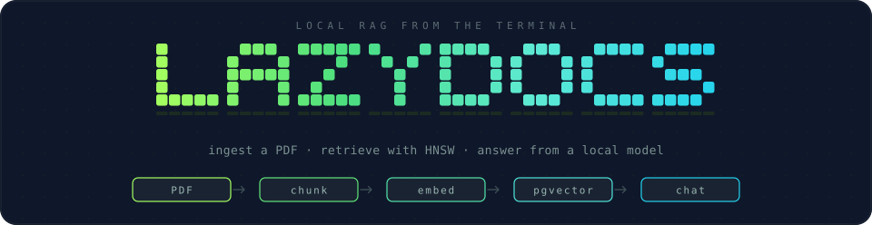
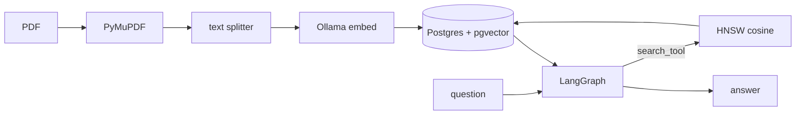
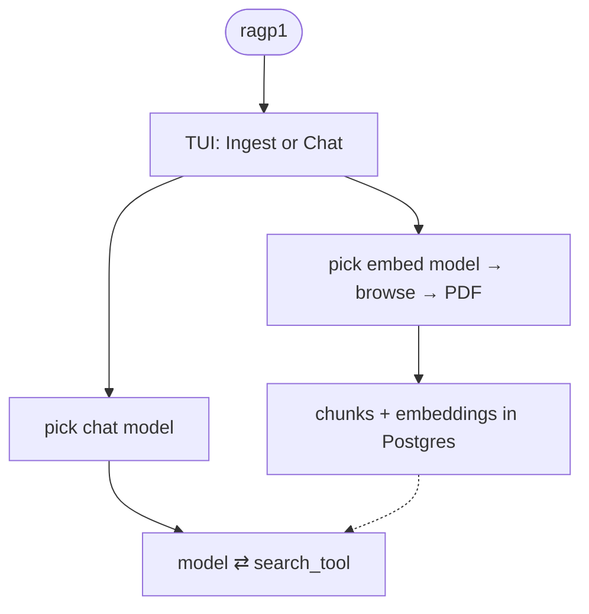
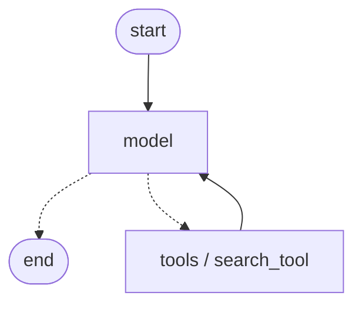

<div align="center">



**Pick a PDF. Embed it locally. Ask it questions.**

Ollama does the embeddings and the chat. Postgres (`pgvector`) keeps the vectors. A Rich TUI is the front door.

<br>

[](https://www.python.org/)
[](https://docs.astral.sh/uv/)
[](https://ollama.com/)
[](https://github.com/pgvector/pgvector)
[](https://github.com/langchain-ai/langgraph)
[](https://docs.docker.com/compose/)

</div>

---

A learning project with the full loop wired: **ingest → retrieve → chat**. The TUI can also pick a chat model and talk to the index you just built.

| Step | What it does |
|---|---|
| **Ingest** | Split a PDF, embed batches with Ollama, persist document + chunk rows |
| **Retrieve** | HNSW index on chunk embeddings (cosine) — same model at query time |
| **Chat** | LangGraph agent calls `search_tool`, then answers from the hits |

The TUI lists only `.pdf` files — that is the format the loader supports. Default embed model is `nomic-embed-text` (768-d); another dimension needs a new migration.

How the pieces work: [`docs/README.md`](docs/README.md).

## How it fits together



Two paths, one store. Ingest writes vectors. Chat embeds the question with the **same** model and walks the HNSW graph for the nearest chunks.



<details>
<summary>Agent loop (compiled graph)</summary>

The chat model either answers or calls `search_tool`. Hits come back as a tool message; the model speaks again until the reply is plain text.



Full walkthrough: [`docs/dev/agent-graph.md`](docs/dev/agent-graph.md).

</details>

## Stack

What actually runs today — grouped the way you hit it.

| Layer | What | Why it's here |
|---|---|---|
| **Interface** | [Typer](https://typer.tiangolo.com/) CLI + [Rich](https://github.com/Textualize/rich) TUI | `ragp1` with no args opens the terminal UI; `ingest` / `query` are one-shot commands |
| **Documents** | [PyMuPDF](https://pymupdf.readthedocs.io/) | Load a PDF as a single LangChain `Document` |
| **Chunk + embed** | [LangChain](https://python.langchain.com/) splitters + [`langchain-ollama`](https://python.langchain.com/docs/integrations/text_embedding/ollama/) | Recursive split, batched `aembed_documents`, model window probed from Ollama |
| **Models** | [Ollama](https://ollama.com/) | Embeddings default to `nomic-embed-text`; chat is whatever local model you pick |
| **Store** | [Postgres 17](https://www.postgresql.org/) + [pgvector](https://github.com/pgvector/pgvector) | `documents` / `chunks` tables; HNSW on `vector(768)` with cosine (`<=>`) |
| **Agent** | [LangGraph](https://github.com/langchain-ai/langgraph) | `model` ⇄ `tools` until a final `AIMessage` |
| **Runtime** | [uv](https://docs.astral.sh/uv/), Docker Compose, [yoyo](https://ollycope.com/software/yoyo/), [Pydantic](https://docs.pydantic.dev/) | One `make up` for deps, database, migrations, and the embed model |
| **Quality** | [pytest](https://docs.pytest.org/) + [Ruff](https://docs.astral.sh/ruff/) | Tests under `tests/`; `make lint` / `make format` |

Python **3.13+**. Chroma and Neo4j show up in `.env.example` as leftovers — they are not wired.

## Quick start

**Needs:** Python 3.13+, [uv](https://docs.astral.sh/uv/), Docker, and [Ollama](https://ollama.com/) running.

```bash
make up
```

That copies `.env` if it is missing, installs deps, starts Postgres, applies migrations, pulls the embed model, and opens the TUI.

Then: **Ingest** → pick the embed model → browse to a `.pdf`. After that, **Chat** and pick a chat model.

Pipeline internals: [`docs/dev/project-up.md`](docs/dev/project-up.md).

## Commands

CLI, after the stack is up:

```bash
uv run ragp1                              # TUI
uv run ragp1 ingest path/to/notes.pdf
uv run ragp1 ingest path/to/notes.pdf --model nomic-embed-text
uv run ragp1 query "What is the notice period?"
uv run ragp1 query "What is the notice period?" --model llama3.1
```

`--model` on ingest overrides `OLLAMA_EMBED_MODEL`. On query it overrides `OLLAMA_MODEL`. Retrieval always embeds with `OLLAMA_EMBED_MODEL` — it has to match what you ingested with.

```bash
uv run pytest
make lint
make format
make db-down          # stop Postgres (keeps the volume)
make db-reset         # drop the volume and start clean
```

## Where things live

```
src/v1/
├── main.py                 CLI composition root (ingest, query, TUI)
├── tui/                    Rich screens: home, file picker, chat
├── app/
│   ├── ingestion/          PDF load → split → embed → persist
│   └── agent/              LangGraph, retrieval, search_tool
└── infra/                  Postgres client + yoyo migrations
docs/dev/                   why / what / mermaid / example JSON per module
tests/
```

| You are looking for… | Open |
|---|---|
| TUI wordmark and colors | `src/v1/tui/logo.py` |
| Split + embed | [`docs/dev/vector-processor.md`](docs/dev/vector-processor.md) |
| Ollama context / embedding size | [`docs/dev/model-metadata.md`](docs/dev/model-metadata.md) |
| HNSW index and `<=>` | [`docs/dev/chunk-index.md`](docs/dev/chunk-index.md) |
| Agent graph | [`docs/dev/agent-graph.md`](docs/dev/agent-graph.md) |
| Conventions | [`docs/dev/conventions.md`](docs/dev/conventions.md) |

## Status

Wired end to end for **PDFs** and a **768-d** embed column. No checkpointer, no multi-format loaders, no hosted models. Useful as a local lab: change a splitter, a tool prompt, or an index parameter and feel it in the TUI.
