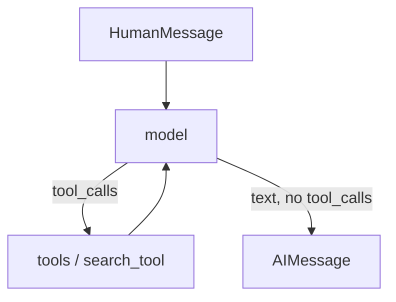
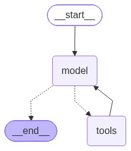
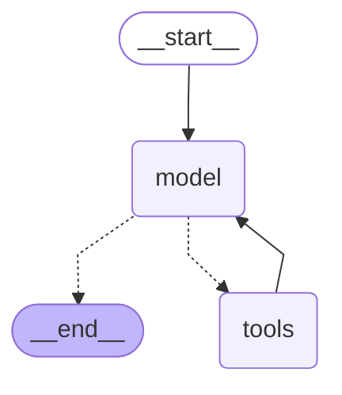

# Agent graph

Code: `src/v1/app/agent/core/graph.py` → `build_graph`. A turn is `Agent.invoke` in `src/v1/app/agent/core/agent.py`.

## Why it exists

A chat model cannot search the ingested PDFs by itself. It either answers from memory or it emits a tool call. The graph is the loop that runs that choice: call the model, maybe run `search_tool`, call the model again, until the reply is plain text.

This is not the HNSW index. That graph lives in Postgres and finds nearby chunks. This one is control flow.

## What it is for

One user message in, one assistant reply out. `InputState` is the new messages; `State` is the full list with `add_messages`, so each node appends instead of replacing history.

It does **not** embed the question (the tool does that), talk to Postgres directly, pick the Ollama model, or persist a thread. `Agent` keeps `messages` on the instance between `invoke` calls. There is no checkpointer yet.

## How it works

Happy path when the answer is in the corpus:



`__start__` always enters `model`. `call_model` sends `state["messages"]` to the chat model with `search_tool` bound. The model either returns `tool_calls` or a final `AIMessage`.

`tools_condition` reads the last message: `tool_calls` present → `tools`; otherwise → `__end__`. `ToolNode` runs `search_tool` (embed query, HNSW lookup) and appends `ToolMessage`s. The solid edge `tools → model` is the cycle.

Small talk never visits `tools`. A retry after zero hits is a second lap around the same cycle. `recursion_limit` (LangGraph default 25) is the backstop if the model never stops calling the tool.

The figures below are the **compiled** graph, from `graph.get_graph()` — the same object `build_graph` returns. Dotted edges are conditional (`tools_condition`). Solid edges always fire.



```text
        +-----------+
        | __start__ |
        +-----------+
               *
               *
               *
          +-------+
          | model |
          +-------+.
          .         .
        ..           ..
       .               .
+---------+         +-------+
| __end__ |         | tools |
+---------+         +-------+
```



Regenerate with:

```python
print(graph.get_graph().draw_ascii())       # needs grandalf
print(graph.get_graph().draw_mermaid())
graph.get_graph().draw_mermaid_png(output_file_path="docs/dev/agent-graph.png")
```

## Example

### Input

```json
{
  "messages": [
    { "type": "human", "content": "What is the notice period?" }
  ]
}
```

### Expected output

```json
{
  "messages": [
    { "type": "human", "content": "What is the notice period?" },
    {
      "type": "ai",
      "content": "",
      "tool_calls": [
        { "name": "search_tool", "args": { "query": "notice period" } }
      ]
    },
    {
      "type": "tool",
      "name": "search_tool",
      "content": "Clause 12. The notice period is 30 days."
    },
    {
      "type": "ai",
      "content": "The notice period is 30 days."
    }
  ]
}
```

`Agent.invoke` returns only that last `content` string. The tool `content` is what the model reads on the second `model` visit; `QueryResult` artifacts stay in the `ToolMessage`, not in this JSON shape.
