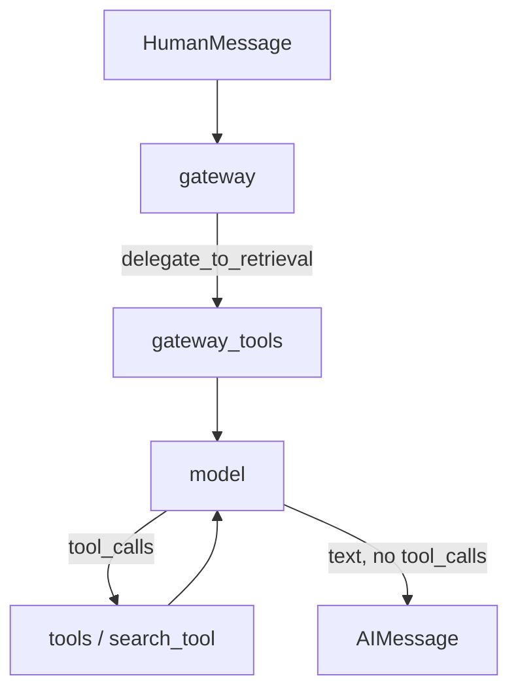
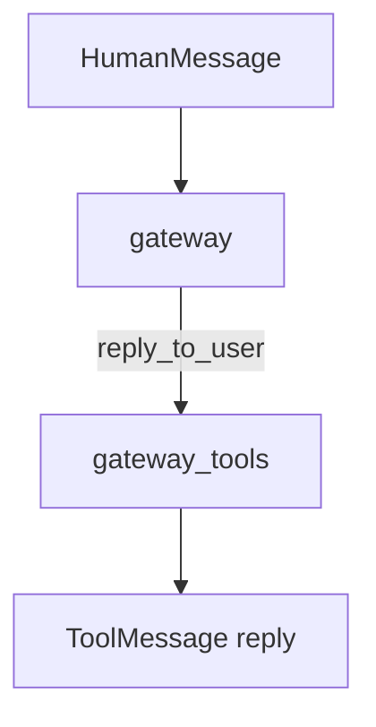
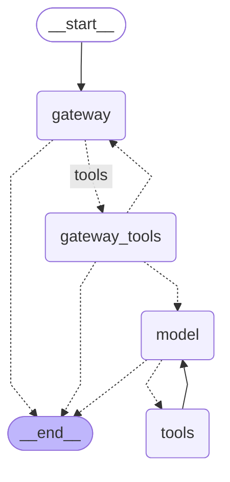

# Agent graph

Code: `src/v1/app/agent/core/graph.py` → `build_graph`. A turn is `Agent.invoke` in `src/v1/app/agent/core/agent.py`.

## Why it exists

A chat model cannot search the ingested PDFs by itself, and it should not treat every message as a retrieval problem. The graph is the control flow that makes that split: a **gateway** decides whether to answer now or hand off, and a **retrieval loop** (`model` ⇄ `search_tool`) only runs when the question may be in the corpus.

This is not the HNSW index. That graph lives in Postgres and finds nearby chunks. This one is control flow.

## What it is for

One user message in, one assistant reply out. `InputState` is the new messages; `State` is the full list with `add_messages`, so each node appends instead of replacing history.

It does **not** embed the question (the retrieval tool does that), talk to Postgres directly, pick the Ollama model, or persist a thread. `Agent` keeps `messages` on the instance between `invoke` calls. There is no checkpointer yet.

The gateway and the retrieval model share history but not a system prompt: each `model_factory` prepends its own prompt for that call and does not write it back into state.

## How it works

Happy path when the answer is in the corpus:



Small talk never leaves the gateway:



`__start__` always enters `gateway`. That node is bound to `reply_to_user` and `delegate_to_retrieval`. `tools_condition` sends tool calls to `gateway_tools` and plain text to `__end__`.

`gateway_tools_condition` reads the trailing `ToolMessage`s: `delegate_to_retrieval` → `model`; `reply_to_user` → `__end__`; any other gateway tool loops back to `gateway`. Extra eval tools can be added later without changing the retrieval subgraph.

`model` is bound only to `search_tool`. Same `tools_condition` as before: tool calls → `tools`; otherwise `__end__`. The solid edge `tools → model` is the retrieval cycle. `recursion_limit` (LangGraph default 25) is the backstop if the model never stops calling the tool.

The figures below are the **compiled** graph, from `graph.get_graph()` — the same object `build_graph` returns. Dotted edges are conditional. Solid edges always fire.



Regenerate with:

```python
print(graph.get_graph().draw_ascii())  # needs grandalf
print(graph.get_graph().draw_mermaid())
graph.get_graph().draw_mermaid_png(output_file_path="docs/dev/agent-graph.png")
```

## Example

### Input

```json
{
  "messages": [
    { "type": "human", "content": "What is the notice period?" }
  ]
}
```

### Expected output

```json
{
  "messages": [
    { "type": "human", "content": "What is the notice period?" },
    {
      "type": "ai",
      "content": "",
      "tool_calls": [
        { "name": "delegate_to_retrieval", "args": {} }
      ]
    },
    {
      "type": "tool",
      "name": "delegate_to_retrieval",
      "content": "Continuing with document retrieval."
    },
    {
      "type": "ai",
      "content": "",
      "tool_calls": [
        { "name": "search_tool", "args": { "query": "notice period" } }
      ]
    },
    {
      "type": "tool",
      "name": "search_tool",
      "content": "Clause 12. The notice period is 30 days."
    },
    {
      "type": "ai",
      "content": "The notice period is 30 days."
    }
  ]
}
```

`Agent.invoke` returns only that last `content` string. For a direct reply the last message is the `reply_to_user` `ToolMessage`. For a corpus question it is the final `AIMessage` from `model`. `QueryResult` artifacts stay in the `search_tool` `ToolMessage`, not in this JSON shape.
