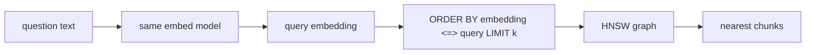

# Chunk vector index

Code: `src/v1/infra/migrations/002.create_chunks.py` → `chunks_embedding_hnsw`. Query contract: `src/v1/app/agent/rag/retrieval.py` → `Retrieval.vector_search`.

## Why it exists

A sequential scan compares the query vector to every chunk. That does not scale. The HNSW index is a proximity graph: search walks nearby neighbors instead of the full table.

The algorithm is Hierarchical Navigable Small World graphs (Malkov & Yashunin): [arXiv:1603.09320](https://arxiv.org/abs/1603.09320).

## What it is for

Approximate nearest-neighbor lookup on `chunks.embedding` with cosine distance (`vector_cosine_ops`).

It does **not** persist rows (the table does that), cluster vectors on disk, embed the question, or pick the embedding model. The column is `vector(768)` to match `nomic-embed-text`. Queries take a vector that is already embedded with that same model.

## How it works



Each stored vector is a node. Edges connect nearby neighbors. Search enters at a sparse upper layer (long hops) and descends to the full bottom layer.

Postgres does not expose a “use HNSW” API. The planner uses `chunks_embedding_hnsw` when the SQL asks for the k nearest rows with the **same operator** the index was built for:

```sql
SELECT id, document_id, content, position,
       embedding <=> %s AS distance
FROM chunks
ORDER BY embedding <=> %s
LIMIT %s
```

`<=>` is pgvector’s **cosine distance**. It is `1 - cosine_similarity`, so **smaller is closer** (`0` is identical direction). That is why the query is `ORDER BY … LIMIT k`, not a similarity threshold. `1 - distance` is cosine similarity if a “higher is better” score is needed.

The index is `vector_cosine_ops`, so only `<=>` rides the graph. pgvector’s other operators (`<->` L2, `<#>` inner product) need a different opclass and would seq-scan this table.

The `%s` vector is the question embedding (768-d). `PostgresClient` already calls `register_vector`, so `Retrieval` can pass the `list[float]` from `VectorSearch` as a bound parameter. Embed the question with the **same** Ollama model used at ingest; a different model or dimension is a different vector space, and the graph returns the wrong neighbors.

HNSW is approximate. Query-time recall vs speed is `hnsw.ef_search` (default `40`). Build parameters (`m`, `ef_construction`) were fixed when the index was created.

`EXPLAIN ANALYZE` on that `ORDER BY … LIMIT` should show `Index Scan using chunks_embedding_hnsw`. A tiny table may still seq-scan; the SQL stays the same.

## Example

### Input

```json
{
  "embedding": [0.12, -0.03, 0.44],
  "k": 2
}
```

### Expected output

```json
{
  "matches": [
    { "chunk_id": "…", "position": 0, "distance": 0.04 },
    { "chunk_id": "…", "position": 3, "distance": 0.11 }
  ]
}
```

`distance` is cosine distance (`<=>`). The vectors in this example are shortened. Retrieval is not wired yet; this is the shape the index is for.
