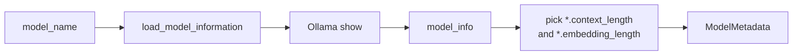

# Model metadata

Code: `src/v1/app/ingestion/vector/utils/utils.py` → `load_model_information`.

## Why it exists

Chunk settings are in **characters**. The embedding model’s limit is in **tokens**. Guessing `chunk_size` per model silently truncates text or wastes context. This probe reads the hard limits from Ollama so those numbers are measured, not invented.

## What it is for

Given a local Ollama model name, it returns that model’s input window and embedding size.

It does **not** pick chunk size or overlap. Those are a policy on top of this metadata. It also does not tokenize, so it cannot convert tokens to characters yet.

## How it works



Architecture prefixes change (`nomic-bert.*`, `bert.*`). The lookup is by suffix, not by a hardcoded key.

If the show call fails, or those two fields are missing, it raises `ModelInfoError`.

## Example

### Input

```json
{
  "model_name": "nomic-embed-text"
}
```

### Expected output

```json
{
  "model_name": "nomic-embed-text",
  "context_length": 2048,
  "embedding_dim": 768
}
```

`context_length` is tokens. `embedding_dim` is the vector size the index must match.
