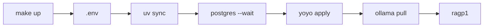

# Project up

Code: `scripts/up.sh` → `make up`.

## Why it exists

A first run needs `.env`, Python deps, Postgres, migrations, and an Ollama embed model. Doing those by hand is easy to skip; ingest then fails on a missing table, empty venv, or missing model. One command brings the stack to a state where `ragp1` can persist vectors.

## What it is for

Bootstraps the local app and opens the TUI.

It does **not** ingest a file, start chat, or install uv / Docker / Ollama. Those three must already be on the machine, and Ollama must be running. It does not overwrite an existing `.env`.

## How it works



`make up` only runs `scripts/up.sh`. The script `cd`s to the repo root, checks `uv`, `docker`, and `ollama`, copies `.env.example` when `.env` is missing, then sources it. `ollama list` must succeed before anything else. Postgres uses `docker compose up -d --wait` so migrate does not race the healthcheck. Yoyo uses `postgresql+psycopg://` because the project has psycopg3 only. The embed model is `OLLAMA_EMBED_MODEL` (default `nomic-embed-text`). `exec uv run ragp1` replaces the script with the TUI.

After the stack is up, ingest is a separate command: `uv run ragp1 ingest path/to/notes.txt`. `make db-down` stops Postgres; it does not remove `.venv` or the pulled model.

## Example

### Input

```json
{
  "command": "make up",
  "have": ["uv", "docker", "ollama"],
  "env_file": null
}
```

### Expected output

```json
{
  "env_file": ".env",
  "postgres": "healthy",
  "tables": ["documents", "chunks"],
  "embed_model": "nomic-embed-text",
  "process": "ragp1"
}
```

If `uv`, `docker`, or `ollama` is missing, or Ollama is not running, the script exits before touching Postgres. `.env` already present is left unchanged.
